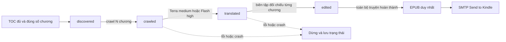

# Kiến trúc và quyết định vận hành

## Lưu trữ

| Lựa chọn | Ưu điểm | Điểm phải trả |
|---|---|---|
| TXT/JSON local + DB metadata | Dễ mở từng file, thuận tiện Git diff bản dịch nhỏ | Hai nơi phải đồng bộ; crash giữa ghi file/cursor; hàng nghìn file; backup phải nhất quán |
| SQLite chứa TEXT/JSON + metadata | Transaction, unique key, backup một logical DB; truy vấn lỗi/tiến độ dễ | Cần CLI hoặc công cụ SQLite để xem/sửa; một writer |
| PostgreSQL | Nhiều máy/worker, vận hành dịch vụ lớn | Thêm server, backup và cấu hình; chưa cần cho side project local |

Chọn SQLite WAL. Với một truyện khoảng 3,459 triệu chữ Hán, riêng văn bản nguồn UTF-8 khoảng 10 MB nếu giả định gần 3 byte/chữ; tổng DB lớn hơn do bản Việt, bản biên tập và lưu response. Đây là ước tính dung lượng, không phải báo giá token. Quy mô này không đòi hỏi storage provider. Raw HTML chưa lưu mặc định; có source URL và hash cho từng chương.

## Trạng thái và job

Khóa `(book_id, number)` và `(book_id, URL)` chống trùng. Bất kỳ chương thiếu/lỗi nào ngăn các bước phụ thuộc đi qua điểm đó. Nguồn, bản dịch và bản biên tập tách cột; không ghi đè nguyên tác. Call có provider, model, prompt hash, reservation, usage và raw response để truy vết.

## Ghép nguồn không phụ thuộc số chương

1. Xác minh tên truyện/tác giả trong trang mục lục, rồi cố định danh mục chuẩn đầy đủ. Không dùng số thứ tự trong nguồn phụ làm ID truyện.
2. Chuẩn hóa Unicode, dấu câu và tiền tố số chương; giữ dấu hiệu phần trên/dưới để tránh nhầm chương bị tách. Tiêu đề duy nhất phải có mốc chương lân cận đúng thứ tự; số chương nguồn phụ có thể lệch bất kỳ khoảng nào.
3. Tiêu đề trùng chỉ được giải quyết bằng chuỗi tiêu đề khớp chính xác, nằm giữa hai mốc chắc chắn và không có khoảng trống trong chuỗi đó. Không áp dụng fuzzy match yếu cho tên chương.
4. Tải tối đa một batch ứng viên, ưu tiên kiểm tra khoảng trống của nguồn chính sớm. Xác minh H1 trên trang thật khớp mục lục, loại nội dung ngắn, font lỗi, trang truy cập bị chặn, dấu hiệu phân trang/ghép chương; đối chiếu số chữ khai báo khi có.
5. Chuẩn hóa văn bản rồi so hash và tỷ lệ chứa chung các cụm 12 ký tự với những chương đã lưu. Mức trùng ≥85% bị từ chối như khả năng lặp hoặc gộp chương. Đây là heuristic phát hiện trùng, không phải chứng minh tương đương ngữ nghĩa.
6. Nếu không đạt, thử nguồn phụ kế tiếp ngay; lỗi mạng có retry giới hạn và cooldown lưu DB. Nếu chưa có ứng viên chắc chắn, đưa chương vào `source_reviews`, không âm thầm đi qua nó trong bước dịch hoặc xuất bản.

Các bảng `source_scans`, `source_candidates`, `source_provenance`, `source_reviews` ghi mục lục, ánh xạ, lượt thử và nguồn thực sự đã chọn. Các bảng được tạo bổ sung khi mở DB cũ; dữ liệu nguồn/dịch cũ không bị xóa khi nâng cấp. Thêm nguồn vào config tự kích hoạt đối chiếu và xem lại các chương đang thiếu; chương đã chấp nhận không bị ghi đè.

SQLite transaction bảo vệ reservation và commit bản dịch. OS file lock bảo vệ toàn bộ worker để không gọi agent/email đồng thời. Lịch được ghi trước dispatch: sau crash có thể đợi đến kỳ tiếp theo nhưng không bắn hàng loạt job bù. Không cần Celery/Redis ở giai đoạn này.

Scheduler là process Python của dự án, độc lập các “task” trong Codex. Khi máy tắt thì không chạy; restart đọc DB để tiếp tục. Sau này có thể đóng gói Docker chạy trên máy riêng nếu muốn 24/7, nhưng file/DB vẫn cần volume local bền vững.

## Liên tục giữa các chương

Mỗi call là session mới, prompt có giới hạn, không resume một chat dài hàng nghìn chương. Dữ liệu ổn định là style skill + glossary. Ngữ cảnh ngắn gồm continuity note và đoạn cuối chương liền trước; hai luồng dịch/biên tập có context tương ứng. Lợi ích là chi phí không tăng theo toàn bộ lịch sử chat. Hạn chế là summary có thể quên chi tiết từ xa; cần thêm registry nhân vật/quan hệ và truy hồi theo thực thể cho bản production.

Một chương tương ứng một call dịch và một call biên tập; không dùng hai provider đồng thời cho cùng bước. Cấu hình hiện chọn provider chung cho hai bước. Có thể đổi provider giữa các batch mà không dịch lại chương đã xong, nhưng nên chạy pilot so sánh trước để tránh lệch văn phong.

## Roadmap và tiêu chí nghiệm thu

1. **Nguồn:** đã có adapter Piaotian và khung bù nguồn. Còn cần toàn văn khả dụng cho chương 1.264; danh mục đủ không có nghĩa nội dung đủ. Xem SOURCES.md.
2. **CLI:** Terra medium đã qua thử live; Gemini CLI đang bị Google từ chối `UNSUPPORTED_CLIENT`. Lỗi provider phụ không chặn provider đang chọn, nhưng cả hai cùng chịu một sổ quota.
3. **Biên tập:** thêm màn hình hoặc CLI review/import response lỗi, glossary có version và registry thực thể; hỗ trợ chương dài theo đoạn và checkpoint cho từng phần.
4. **EPUB:** EPUBCheck + Kindle Previewer, test tiếng Việt và TOC trên thiết bị thật; chỉ sau đó bật SMTP và thử một sách mẫu được chấp thuận.
5. **Vận hành:** launcher một lần mở, backup SQLite hàng ngày, báo cáo trạng thái và log xoay vòng đã có. Fair scheduling giữa truyện, thông báo ra ngoài và API adapters là các mở rộng sau.

Kiểm thử bao gồm tiếp tục, ngân sách, crash, ghép nguồn lệch số, nguồn sai/trùng/cắt, lấy bù, lịch, chống gửi trùng và cấu trúc EPUB; có thêm kiểm thử thật với nguồn/CLI. Chưa thể bảo đảm chất lượng ngữ nghĩa hoàn hảo hoặc việc sách đã đến Kindle vật lý từ một lần SMTP chấp nhận.
